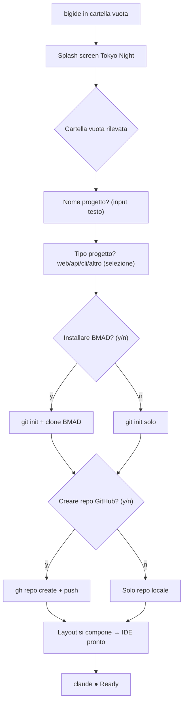
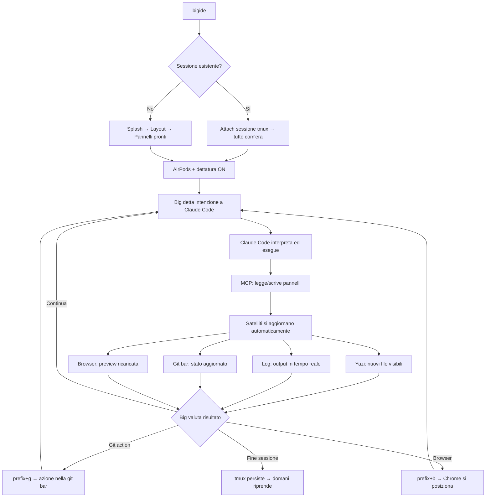
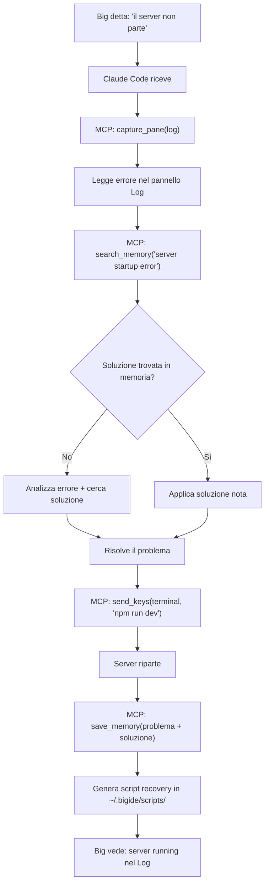
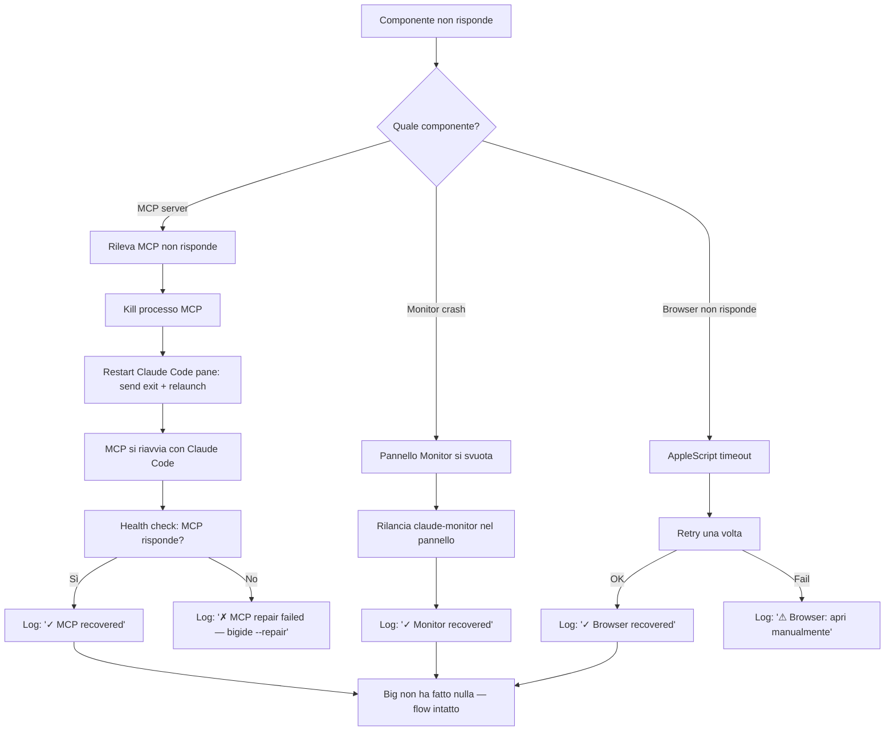
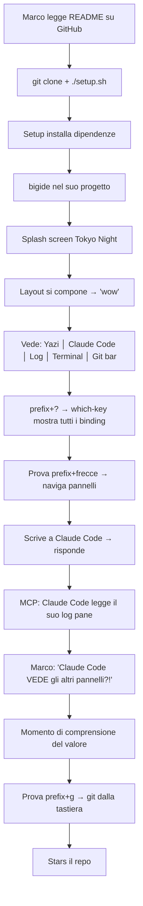

# UX Design Specification BigIDE

**Author:** Big
**Date:** 2026-02-19

---

## Executive Summary

### Project Vision

BigIDE è un ambiente di sviluppo terminale-first dove l'IA non è integrata — è centrale. Costruito su tmux + Ghostty, orchestrato da Claude Code via MCP server, è progettato per sviluppatori che vivono nel terminale e vogliono un'esperienza di flow state ininterrotto. L'origine è personale: il creatore vive con il Parkinson e usa la voce come input primario. BigIDE è l'ambiente costruito attorno a questa realtà.

### Target Users

**Utente Primario — Big (il creatore)**
- Input primario: voce via dettatura (AirPods + Whisper.cpp)
- Tastiera: solo per shortcut e navigazione rapida
- Mouse: escluso dal design
- Sessioni: fino a 5 ore continuative
- Necessità: flow state, zero attriti, autonomia completa

**Utente Futuro — "Marco" (lo sviluppatore curioso)**
- Trova BigIDE su GitHub
- Cerca efficienza radicale in un ambiente keyboard-first con IA
- Non ha necessariamente disabilità motorie
- Prima impressione: deve essere stupito da eleganza, coerenza e qualità degli strumenti

### Key Design Challenges

1. **Voce come input primario in un contesto terminale** — Feedback visivo di dettatura, gestione errori di trascrizione, indicatore di stato prominente
2. **Sessioni di 5 ore senza fatica visiva** — Tema ad alto contrasto ma gentile, densità informativa calibrata, riduzione del rumore visivo
3. **Minimalismo funzionale** — Ogni elemento deve guadagnarsi il suo posto sullo schermo. Pochi pannelli, zero ornamenti, nessuna informazione non essenziale
4. **Trasparenza dell'agente IA** — Rendere visibile cosa fa Claude Code senza interrompere il flow del direttore d'orchestra (Big)

### Design Opportunities

1. **Eleganza come differenziatore** — Splash screen curato, tema coerente, layout stabile e armonioso. Prima impressione memorabile
2. **Voice-first developer environment** — Nessun competitor offre questo. Vantaggio UX enorme se progettato nativamente
3. **Semplicità radicale vs complessità dei competitor** — Mentre altri aggiungono, BigIDE toglie. Strumento artigianale: pochi pezzi, ognuno perfetto
4. **Flow state by design** — Layout che elimina il context-switching. Tutto visibile, tutto raggiungibile via shortcut o voce

## Core User Experience

### Defining Experience

BigIDE è un ambiente a stella: la console di Claude Code è il centro gravitazionale, tutti gli altri elementi orbitano attorno ad essa come satelliti funzionali. L'utente primario (Big) detta comandi vocalmente a Claude Code, che è il traduttore tra voce e azione. L'azione core è il dialogo vocale con Claude Code — tutto il resto è contesto visivo di supporto.

Il loop fondamentale:
1. Big detta un'intenzione (voce → Claude Code)
2. Claude Code esegue (codice, comandi, file, git)
3. I pannelli satelliti riflettono il risultato (log, browser, file explorer, git status)
4. Big valuta e detta la prossima intenzione

### Platform Strategy

- **Piattaforma:** macOS esclusivo (Apple Silicon), terminale fullscreen
- **Input primario:** Voce (dettatura via AirPods + Whisper.cpp)
- **Input secondario:** Tastiera (solo shortcut e navigazione)
- **Input escluso:** Mouse (non previsto nel design)
- **Display:** Singola finestra Ghostty fullscreen, layout tmux a pannelli
- **Sessioni:** Progettato per sessioni prolungate (fino a 5 ore)
- **Offline:** Non applicabile (Claude Code richiede connessione)

### Effortless Interactions

**Deve essere invisibile (zero pensiero richiesto):**
- Navigazione tra pannelli (shortcut immediato, sempre prevedibile)
- Visualizzazione log (aggiornamento continuo, nessuna azione richiesta)
- Aggiornamento file explorer dopo operazioni (automatico)
- Status git nella barra (sempre visibile, sempre aggiornato)
- Anteprime file (automatiche alla selezione in Yazi)

**Deve essere un solo gesto:**
- Aprire Chrome con la preview del progetto
- Fare commit e push
- Switchare branch
- Zoomare un pannello a fullscreen e tornare indietro
- Attivare/disattivare la dettatura vocale

### Critical Success Moments

| Momento | Cosa succede | Perché è critico |
|---------|-------------|-----------------|
| **Primo lancio (Marco)** | Vede il layout partizionato e il tema Catppuccin Mocha | La bellezza comunica qualità prima dell'uso |
| **Fine giornata (Big)** | 5 ore senza frizioni, senza uscire dal flow | È la misura definitiva del successo del design |
| **Browser integration** | Chrome si apre, si posiziona, mostra la preview | Punto di rottura: se fallisce, il flow muore |
| **Git operations** | Commit/push/branch via shortcut senza errori | Punto di rottura: git rotto = frustrazione immediata |
| **Prima dettatura** | Big parla, Claude Code riceve ed esegue | Il momento "wow" — la voce diventa codice |

### Experience Principles

1. **"La Console è Sacra"** — Claude Code è il centro gravitazionale. Riceve lo spazio maggiore, l'attenzione primaria del layout, zero distrazioni. Ogni decisione di design protegge la prominenza della console.

2. **"Satelliti Silenziosi"** — Log, browser, file explorer, git bar, anteprime: informano senza interrompere. Visibili ma discreti, utili ma mai invadenti. Non richiedono attenzione — la offrono.

3. **"Il Flow è la Misura"** — Ogni decisione UX si valuta con una domanda: "Questo protegge il flow o lo rompe?" Se a fine giornata non ci sono state frizioni, il design ha funzionato.

4. **"La Bellezza è la Porta"** — L'eleganza visiva non è decorazione, è comunicazione. Il primo impatto deve bastare per far capire che questo è uno strumento serio, curato, pensato.

## Desired Emotional Response

### Primary Emotional Goals

**"Mi sento Dio"** — Onnipotenza creativa attraverso la voce. L'utente parla e il sistema esegue. Non c'è distanza tra intenzione e azione. Ogni comando vocale è un atto di creazione. Questa è l'emozione primaria: il potere assoluto di chi controlla attraverso la parola.

**"La tana del Bianconiglio"** — Immersione totale. L'utente scivola nel codice e nel progetto come Alice che cade nel mondo delle meraviglie. Si perde nel flow — e non vuole uscirne. Il tempo scompare, il mondo esterno scompare, resta solo il progetto.

**"Perfezione ed ergonomia"** — Il layout, i colori, le proporzioni trasmettono una sensazione di ordine perfetto. Non è solo bello — è *giusto*. Ogni elemento è esattamente dove deve essere.

### Emotional Journey Mapping

| Fase | Emozione Target | Trigger UX |
|------|----------------|------------|
| **Primo lancio** | Stupore, ammirazione | Splash screen → layout che si compone → tema Catppuccin Mocha |
| **Inizio sessione** | Calma, familiarità | "Sono a casa" — sessione ripristinata, tutto com'era |
| **Dettatura attiva** | Onnipotenza, flow | La voce diventa codice — zero latenza percepita |
| **Navigazione pannelli** | Fluidità, padronanza | Shortcut immediati, transizioni pulite |
| **Errore/problema** | Fiducia, sicurezza | "So che si risolve" — feedback chiaro, recovery in un gesto |
| **Fine sessione (5h)** | Soddisfazione, orgoglio | "Ho creato tutto questo oggi, senza frizioni" |
| **Ritorno il giorno dopo** | Calma, continuità | Sessione intatta, contesto preservato, zero ramp-up |

### Micro-Emotions

**Emozioni da coltivare:**
- **Fiducia** — Il sistema funziona, sempre. Quando qualcosa va storto, so che si risolve in un gesto. Non devo preoccuparmi.
- **Calma** — Tutto è sotto controllo. L'ambiente è stabile, prevedibile, rassicurante. Nessuna sorpresa sgradita.
- **Magia** — Le cose succedono. Non devo microgestire ogni passo. Detto un'intenzione e il risultato appare. Claude Code è il mago, Big è il direttore.

**Emozioni da evitare:**
- **Frustrazione** — Mai. Nessun dead-end, nessun errore senza via d'uscita, nessun momento "non so cosa fare".
- **Confusione** — Mai. Ogni elemento è autoesplicativo. Lo stato del sistema è sempre chiaro.
- **Ansia** — Mai. Nessun "ho paura di rompere qualcosa". Le azioni sono sicure, i rollback sono facili.
- **Fatica** — Mai. Dopo 5 ore, la stanchezza è fisica, non cognitiva. Il sistema non ha aggiunto carico mentale.

### Design Implications

| Emozione | Implicazione UX |
|----------|----------------|
| Onnipotenza | La console Claude Code domina visivamente. Risposta immediata ai comandi. Nessun passaggio intermedio tra voce e azione |
| Immersione | Layout stabile che non si muove. Zero notifiche non richieste. Tema scuro che avvolge. Nessun elemento che "tira fuori" dal flow |
| Perfezione | Allineamenti pixel-perfect. Proporzioni armoniche tra pannelli. Tema coerente su ogni elemento. Nessun glitch visivo |
| Fiducia | Messaggi di errore chiari e azionabili. Recovery sempre disponibile (`--repair`). Stato del sistema sempre visibile |
| Calma | Animazioni minime e fluide. Colori gentili (Catppuccin Mocha). Nessun lampeggiamento. Densità informativa bassa |
| Magia | Automazioni invisibili. Claude Code che agisce via MCP senza che Big debba spiegare il "come". Risultati che appaiono |

### Emotional Design Principles

1. **"La Voce è Potere"** — Ogni interazione vocale deve rinforzare la sensazione di onnipotenza creativa. Zero latenza percepita, zero passaggi intermedi, zero "non ho capito".

2. **"Il Rabbit Hole è Sicuro"** — L'immersione totale è possibile solo se l'ambiente è affidabile. La fiducia nel sistema è il prerequisito del flow. Nessun errore deve spezzare l'incantesimo.

3. **"La Perfezione è Silenziosa"** — L'ergonomia perfetta non si nota. Si nota solo quando manca. Il design migliore è quello che l'utente non percepisce consciamente ma che sente nelle ossa.

4. **"La Magia ha un Direttore"** — Claude Code fa la magia, Big dà le direzioni. L'utente non è passivo — è il regista. La magia serve la visione del direttore, non la sostituisce.

## UX Pattern Analysis & Inspiration

### Inspiring Products Analysis

**Apple TV+**
- Estetica cinematografica: ogni schermata è un poster, niente di superfluo
- Coerenza totale: palette colori, tipografia, spaziature — tutto segue lo stesso linguaggio
- Transizioni fluide: nessuno scatto, nessun salto, ogni movimento è intenzionale
- Content-first: il contenuto domina, l'interfaccia scompare
- Lezione per BigIDE: la qualità percepita è un linguaggio. BigIDE deve comunicare "premium" dal primo pixel

**VS Code**
- Keyboard-first: Command Palette, keybinding per tutto, navigazione senza mouse
- Ecosistema temi: Catppuccin, One Dark, Tokyo Night — la personalizzazione visiva è parte dell'identità
- Split panes: layout flessibili, ogni pannello ha uno scopo
- Difetto critico: troppa roba. Estensioni, sidebar, minimap, breadcrumbs, notifiche. L'opposto del minimalismo
- Lezione per BigIDE: prendere la filosofia keyboard-first e i temi, eliminare tutto il rumore

**Terminale (puro)**
- Velocità assoluta: zero overhead tra input e output
- Essenzialità: nessun framework grafico, nessuna astrazione inutile
- Potenza grezza: il computer risponde direttamente
- Lezione per BigIDE: non tradire mai la natura del terminale. L'eleganza si aggiunge, la velocità non si sacrifica

**LazyVim**
- Dashboard d'avvio: bella, informativa, accogliente
- Which-key: i keybinding appaiono contestualmente, tutto è scopribile senza memorizzare
- Statusline curata: branch git, diagnostici, modalità — solo informazioni utili
- Coerenza visiva: tema applicato uniformemente su ogni elemento
- Lezione per BigIDE: un TUI può essere stupefacente. LazyVim è la prova vivente. La splash screen e la status bar devono raggiungere questo livello

### Transferable UX Patterns

**Pattern Visivi:**
- Tema scuro premium stile Apple (Catppuccin Mocha come base, coerenza su ogni elemento)
- Content-first hierarchy: il pannello Claude Code domina come il contenuto domina su Apple TV+
- Transizioni pulite tra pannelli (nessun flash, nessun glitch)

**Pattern di Navigazione:**
- Keyboard-first come VS Code ma senza command palette (shortcut diretti, più veloci)
- Which-key contestuale come LazyVim per scopribilità dei binding (prefix + attesa → mostra opzioni disponibili)
- Navigazione direzionale con frecce (non vim-style hjkl — decisione già presa nel PRD)

**Pattern di Informazione:**
- Statusline stile LazyVim: branch, stato, informazioni essenziali
- Zero notifiche push — le informazioni sono sempre visibili nei pannelli satelliti, non in popup
- Densità informativa bassa come Apple TV+ — spazio scuro è un elemento di design

**Pattern di Onboarding:**
- Splash screen come LazyVim dashboard: logo, stato, progresso
- Zero tutorial — il sistema è autoesplicativo
- Which-key come discovery tool: non serve un manuale

### Anti-Patterns to Avoid

| Anti-Pattern | Fonte | Perché evitarlo |
|-------------|-------|----------------|
| Extension bloat | VS Code | Aggiunge complessità, instabilità, incoerenza visiva |
| Sidebar sempre visibile | VS Code | Occupa spazio, distrae, non serve sempre |
| Minimap | VS Code | Rumore visivo puro, nessun valore in un terminale |
| Breadcrumbs/tabs multipli | VS Code | Complessità navigazionale — BigIDE ha tmux tabs |
| Notifiche toast | Molte app | Rompono il flow, tirano fuori dal rabbit hole |
| Mouse-first con keyboard come alternativa | IDE tradizionali | Invertito rispetto a BigIDE: qui la tastiera è primaria |
| Settings UI complessa | VS Code | Un file JSON/YAML è più veloce e più potente |
| Animazioni eccessive | Molte app | Rallentano, distraggono, contraddicono la velocità del terminale |

### Design Inspiration Strategy

**Da adottare integralmente:**
- Coerenza visiva Apple: un tema, applicato ovunque, senza eccezioni
- Keyboard-first VS Code: ogni azione ha un binding, nessuna richiede il mouse
- Velocità terminale: zero overhead percepito
- Splash dashboard LazyVim: primo impatto curato e informativo

**Da adattare:**
- Which-key LazyVim → adattato al contesto tmux (prefix + timeout → mostra binding disponibili)
- Statusline LazyVim → adattata a tmux status bar (gitmux + info custom)
- Content-first Apple TV+ → Claude Code come "contenuto primario" del layout

**Da evitare categoricamente:**
- Qualsiasi pattern che richieda il mouse come input primario
- Qualsiasi aggiunta di UI chrome che non sia strettamente necessaria
- Qualsiasi notifica che interrompa il flow
- Qualsiasi complessità configurazionale non necessaria

## Design System Foundation

### Design System Choice

**Tokyo Night — Night variant** come sistema di design unificato per BigIDE. Un singolo tema applicato coerentemente su tutti i tool dell'ecosistema.

Approccio: **tema unico nel MVP**, con architettura predisposta per multi-tema in futuro (Tokyo Night Storm, Moon, e altri temi).

> **Nota:** Le sezioni precedenti menzionano Catppuccin Mocha come riferimento iniziale dal PRD. La decisione finale dopo analisi comparativa è **Tokyo Night Night**.

### Rationale for Selection

1. **Sessioni di 5 ore** — I toni freddi (blu, ciano, viola) di Tokyo Night affaticano meno gli occhi rispetto a palette calde o sature
2. **Coerenza Apple-level** — Tokyo Night ha port ufficiali/community per tutti i tool di BigIDE: Ghostty, tmux, Neovim/LazyVim, Yazi, lazygit, fzf, bat, delta
3. **Immersione** — Lo sfondo `#1a1b26` è profondo quasi nero, perfetto per il "rabbit hole" — lo schermo scompare, resta solo il contenuto
4. **Eleganza cyberpunk** — L'estetica richiama le luci di Tokyo di notte: sofisticata, moderna, riconoscibile. Stupisce Marco al primo sguardo
5. **Contrasto eccellente** — Il foreground `#c0caf5` su sfondo scuro garantisce leggibilità senza stancare

### Implementation Approach

**Palette di riferimento — Tokyo Night Night:**

| Ruolo | Colore | Hex |
|-------|--------|-----|
| Background | Blu notte profondo | `#1a1b26` |
| Foreground | Bianco-lavanda | `#c0caf5` |
| Selection | Blu scuro | `#283457` |
| Comment/Subtle | Grigio-blu | `#565f89` |
| Red (errori) | Rosa caldo | `#f7768e` |
| Orange (warning) | Ambra | `#ff9e64` |
| Yellow (info) | Oro morbido | `#e0af68` |
| Green (success) | Verde salvia | `#9ece6a` |
| Teal (accent) | Verde acqua | `#73daca` |
| Cyan (link/highlight) | Ciano chiaro | `#7dcfff` |
| Blue (primario) | Blu lavanda | `#7aa2f7` |
| Magenta (accent secondario) | Viola morbido | `#bb9af7` |

**Applicazione per tool:**

| Tool | Config mechanism | Port Tokyo Night |
|------|-----------------|------------------|
| Ghostty | CLI flags (`--background`, `--foreground`) | Colori inline dalla palette |
| tmux | `~/.bigide/tmux/tmux.conf` | tokyo-night-tmux plugin |
| Neovim/LazyVim | `NVIM_APPNAME=bigide` | tokyonight.nvim (style="night") |
| Yazi | `YAZI_CONFIG_HOME=~/.bigide/yazi` | theme.toml Tokyo Night |
| lazygit | Config in `~/.bigide/` | Tokyo Night custom theme |
| fzf | Variabili env `FZF_DEFAULT_OPTS` | Colori Tokyo Night |
| bat | `BAT_THEME` | tokyonight_night |
| gitmux | `~/.bigide/gitmux.conf` | Colori manuali dalla palette |
| Splash screen | ANSI escape codes | Colori mappati alla palette |

### Customization Strategy

**MVP — Tema unico, zero configurazione:**
- Tokyo Night Night applicato a tutti i tool senza opzioni
- L'utente non sceglie il tema — BigIDE *è* Tokyo Night Night
- Coerenza garantita: impossibile avere tool con temi diversi

**Futuro — Multi-tema:**
- Architettura a token: i colori sono variabili, non hardcoded
- `~/.bigide/config.json` → `"theme": "tokyonight-night"`
- Cambio tema = una riga di config + restart
- Temi supportabili: Tokyo Night Storm/Moon, Catppuccin, Dracula, Nord, Rosé Pine

**Regole di coerenza visiva:**
- Bordi tmux: `#283457` (selection color) — visibili ma discreti
- Pannello attivo: bordo `#7aa2f7` (blue primario) — chiara indicazione focus
- Status bar: sfondo `#16161e` (più scuro del bg) con testo `#565f89` (subtle) e accent `#7aa2f7`
- Nerd Font: JetBrains Mono Nerd Font — stessa font ovunque
- Icone: Nerd Font icons coerenti (Yazi, statusline, splash)

## Defining Core Experience

### Defining Experience

**"BigIDE is Happiness"**

La defining experience di BigIDE non è un'azione — è uno stato emotivo. La felicità di programmare senza barriere. La felicità del direttore d'orchestra che sta sul podio e l'intera sinfonia risponde.

Se tradotta in interazione: Big detta un'intenzione, Claude Code la comprende e la realizza, i pannelli satelliti mostrano il risultato, e Big non ha mai lasciato il suo posto. Nessuna finestra da cercare, nessuno scroll per ritrovare l'output, nessun context-switch.

In una frase per Marco: "BigIDE è il posto dove parli e il progetto prende forma attorno a te."

### User Mental Model

**Il modello mentale: Direttore d'Orchestra**

Big si vede come il regista. Claude Code è l'esecutore. I pannelli sono gli strumentisti. Il layout è il palcoscenico. Big non suona gli strumenti — li dirige.

**Oggi (senza BigIDE) — il dolore:**
- Tante sessioni Ghostty aperte, ognuna un contesto diverso
- Browser aperto da qualche parte, scroll continuo per trovare output
- Contesto frammentato: informazioni sparse su più finestre
- Gestione manuale di git, MCP, skills, configurazioni
- Il "direttore" è costretto a correre tra gli strumentisti

**Domani (con BigIDE) — la promessa:**
- Una sola finestra fullscreen, tutto visibile
- Claude Code al centro, satelliti attorno
- Zero scroll: l'informazione è dove la cerchi, sempre
- Git, MCP, skills gestiti automaticamente o con un singolo shortcut
- Il direttore resta sul podio

### Success Criteria

**L'utente dice "this just works" quando:**
- Apre BigIDE e ritrova tutto come l'ha lasciato
- Detta un'intenzione e Claude Code la realizza senza chiedere chiarimenti
- Guarda il pannello log e vede cosa sta succedendo senza azioni
- Fa commit+push con un solo shortcut, senza popup di errore
- Il browser si apre nel posto giusto la prima volta

**L'utente si sente "happy" quando:**
- Claude Code realizza quello che sta pensando, non solo quello che ha detto
- Arriva a fine giornata (5 ore) e non ha avuto frizioni
- Non ha mai toccato il mouse
- Non ha mai dovuto gestire manualmente git, MCP o configurazioni

**Indicatori di fallimento:**
- Big deve aprire una seconda finestra → il layout ha fallito
- Big deve scrollare per trovare un output → l'informazione non è al posto giusto
- Big deve fare più di un gesto per un'azione comune → troppi passi
- Big deve gestire manualmente git/MCP/skills → automazione mancante

### Novel UX Patterns

**Pattern innovativo: "Voice-to-Everything"**
- Non esiste un ambiente di sviluppo dove la voce è l'input primario e l'IA è il traduttore universale tra intenzione e azione
- BigIDE combina pattern familiari (tmux panes, shortcut, status bar) in un modo radicalmente nuovo: orchestrati dalla voce via IA
- Non serve insegnare niente: chi conosce il terminale riconosce tmux; chi conosce Claude Code riconosce il dialogo; la novità è che sono uniti in un unico ambiente coerente

**Pattern stabiliti riutilizzati:**
- Split panes (tmux — universalmente compreso)
- Keyboard shortcuts con prefix (tmux — pattern maturo)
- File browser laterale (VS Code, Yazi — familiare)
- Status bar con git info (LazyVim, VS Code — aspettato)
- Splash screen con progresso (LazyVim — accogliente)

**Pattern combinato unico:**
- Which-key (da LazyVim) + tmux prefix = scopribilità dei binding senza manuale
- MCP server + tmux panes = IA che vede e agisce su tutto l'ambiente (nessun competitor ha questo)
- Voce + Claude Code + MCP = "parla e il progetto si muove"

### Experience Mechanics

**1. Initiation — Entrare nel flow:**
- `bigide` nel terminale (o sessione che si ripristina)
- Splash screen Tokyo Night → layout che si compone → tutto pronto
- Big mette gli AirPods, attiva la dettatura, è sul podio

**2. Interaction — Il loop core:**
- Big detta un'intenzione a Claude Code (voce → testo nel pannello Claude Code)
- Claude Code interpreta, esegue, usa MCP per leggere/scrivere sugli altri pannelli
- I satelliti si aggiornano: file explorer mostra nuovi file, log mostra output, git bar aggiorna lo stato
- Big valuta il risultato guardando i pannelli senza switchare
- Big detta la prossima intenzione → il loop ricomincia

**3. Feedback — Sapere che funziona:**
- Il pannello log mostra in tempo reale cosa sta succedendo
- Il file explorer si aggiorna automaticamente dopo ogni operazione
- La git bar cambia stato dopo ogni commit
- Il browser ricarica la preview (se dev server attivo)
- Nessun feedback richiede azione — è passivo e visibile

**4. Completion — Fine sessione:**
- Big chiude (o lascia aperto per domani — tmux persiste)
- Riapertura: `bigide` → sessione ripristinata, identica
- Nessun salvataggio manuale, nessun "sei sicuro?", nessun cleanup

## Visual Design Foundation

### Color System

**Palette primaria: Tokyo Night Night**
Riferimento completo nella sezione Design System Foundation.

**Applicazione semantica dei colori:**

| Ruolo semantico | Colore | Hex | Uso |
|----------------|--------|-----|-----|
| Sfondo principale | Blu notte | `#1a1b26` | Background di tutti i pannelli |
| Sfondo status bar | Nero profondo | `#16161e` | Top bar e bottom bar |
| Testo primario | Bianco-lavanda | `#c0caf5` | Contenuto principale |
| Testo secondario | Grigio-blu | `#565f89` | Info meno importanti, commenti |
| Bordi pannelli | Blu scuro | `#283457` | Separatori tra pane tmux |
| Bordo pannello attivo | Blu lavanda | `#7aa2f7` | Focus indicator |
| Successo | Verde salvia | `#9ece6a` | Git clean, operazione riuscita |
| Warning | Ambra | `#ff9e64` | Attenzione, modifiche non committate |
| Errore | Rosa caldo | `#f7768e` | Errori, conflitti |
| Accent primario | Blu lavanda | `#7aa2f7` | Elementi interattivi, tab attivo |
| Accent secondario | Viola morbido | `#bb9af7` | Evidenziazioni, keyword |

### Typography System

**Font unico: JetBrainsMono Nerd Font**

| Proprietà | Valore |
|----------|--------|
| Font family | `JetBrainsMono Nerd Font` |
| Font size | 13 |
| Legature | Disabilitate (`font-feature = "liga" 0, "calt" 0`) |
| Icone | Nerd Font icons integrati nel font |

**Rationale:**
- Size 13: equilibrio ottimale tra leggibilità e densità informativa per sessioni di 5 ore su display Retina Apple Silicon
- No legature: il codice si legge carattere per carattere, nessuna ambiguità visiva. `!=` resta `!=`, `=>` resta `=>`
- Nerd Font: icone inline senza font secondario (Yazi, statusline, splash screen usano le stesse icone)

**Gerarchia tipografica (solo terminale):**
- Non c'è gerarchia font-size (monospace, size fisso ovunque)
- La gerarchia si esprime tramite **colore**: testo primario (`#c0caf5`) vs secondario (`#565f89`) vs accent (`#7aa2f7`)
- E tramite **posizione**: il pannello Claude Code è il più grande, quindi il suo testo è il più prominente per pura proporzione

### Spacing & Layout Foundation

**Filosofia: Arioso**

L'ambiente deve respirare. Ispirazione Apple TV+: lo spazio vuoto (spazio scuro) è un elemento di design, non uno spreco. Meno informazione sullo schermo = meno carico cognitivo per 5 ore.

**Bordi tra pannelli:**
- Stile: sottili ma visibili — linea singola tmux
- Colore inattivo: `#283457` (selection color — presente ma discreto)
- Colore attivo: `#7aa2f7` (blue primario — chiaro indicatore focus)
- I bordi separano le zone senza creare "gabbie" visive

**Spaziatura interna pannelli:**
- Padding: almeno 1 carattere di margine dal bordo in ogni pannello
- Il contenuto non tocca mai i bordi — respira

**Layout definitivo:**

```
┌──────────────────────────────────────────────────────┐
│ [Tab1] [Tab2] [Tab3]           CPU% │ RAM% │ 19:48  │ ← Top bar
├────────────┬─────────────────────────────────────────┤
│            │                                         │
│            │                                         │
│            │          Claude Code                    │
│   Yazi     │                                         │
│            │                                         │
│            │                                         │
│            ├──────────────┬──────────────────────────┤
│            │              │                          │
├────────────┤     Log      │      Terminal            │
│  Monitor   │              │                          │
│            ├──────────────┴──────────────────────────┤
│            │  main ✓ │ +3 ~1 -0 │ ↑0 ↓0 │ clean  │ ← Git bar
└────────────┴─────────────────────────────────────────┘
```

**Struttura a zone:**
- **Colonna sinistra (25% larghezza):** Zona strumenti verticale continua
  - Yazi (sopra): ~70% altezza colonna — esteso fino a metà zona Log
  - Monitor (sotto): ~30% altezza colonna — compatto, solo info essenziali
- **Zona destra superiore (75% larghezza, ~65% altezza):** Claude Code — il sole del sistema
- **Zona destra inferiore (75% larghezza, ~35% altezza):**
  - Log (35% larghezza zona): output in tempo reale
  - Terminal (65% larghezza zona): shell interattiva
- **Git bar:** Solo sotto Log e Terminal, non full-width. Info git contestuali alla zona di lavoro

**Top bar (tmux status bar):**
- Sinistra: tab dei progetti (nome progetto per tab)
- Destra: CPU% │ RAM% │ data e ora
- Sfondo: `#16161e` (più scuro del bg principale)
- Tab attivo: accent `#7aa2f7`, tab inattivi: `#565f89`

**Git bar (bottom, sotto Log/Terminal):**
- Tutte le informazioni git: branch, stato (clean/dirty), file added/modified/deleted, ahead/behind, hash ultimo commit
- Sfondo: `#16161e`
- Branch name: `#7aa2f7` (accent)
- Clean: `#9ece6a` (green)
- Dirty/modified: `#ff9e64` (orange)
- Errore/conflitto: `#f7768e` (red)

**Nota implementativa:** La git bar non è la tmux status bar (che è full-width in top). È un pannello tmux dedicato di 1 riga posizionato sotto Log/Terminal, con gitmux che scrive direttamente nel pannello. Questo permette di avere la git bar solo nella zona destra inferiore.

### Accessibility Considerations

**Progettato per Parkinson e sessioni prolungate:**

- **Zero dipendenza mouse**: ogni interazione è tastiera o voce
- **Contrasto**: foreground `#c0caf5` su background `#1a1b26` = rapporto 11.4:1 (supera WCAG AAA)
- **Font size 13**: leggibile su Retina senza sforzo, sufficientemente grande per non affaticare in 5 ore
- **Shortcut one-hand friendly**: prefix + tasti raggiungibili con una mano (decisione dal PRD)
- **Colori semantici**: rosso=errore, verde=ok, ambra=attenzione — mapping universale, nessuna ambiguità
- **Densità bassa (arioso)**: meno informazione = meno carico cognitivo
- **Bordi visibili**: separazione chiara delle zone senza dover "cercare" dove finisce un pannello e inizia un altro
- **No animazioni**: zero movimento non necessario, zero distrazione
- **No lampeggiamento**: nessun blink cursor aggressivo, nessun flash su errore

## Design Direction Decision

### Design Directions Explored

Tre direzioni visive esplorate per il layout BigIDE:

- **A "Minimal Tokyo"** — Massimo respiro, info essenziali, bordi sottilissimi. Estetica ultra-minimale.
- **B "Neon Accent"** — Bordi doppi per pannello attivo, icone prominenti, più impatto visivo immediato.
- **C "Clean Dashboard"** — Status bar ricche, tree view per file, separatori puliti, git bar espanso con tutte le info.

### Chosen Direction

**Direzione C — "Clean Dashboard"**

Un approccio che bilancia eleganza e completezza informativa. Ogni pannello mostra informazioni ricche ma organizzate con chiarezza. Il layout respira ma non spreca spazio. Le status bar sono complete senza essere affollate.

### Design Rationale

1. **Tree view in Yazi** — Mostra la struttura del progetto con indentazione (`├ routes/`, `├ lib/`), più leggibile di un elenco piatto. Big vede la gerarchia senza navigare
2. **Git bar espanso** — branch │ stato │ added/modified/deleted │ ahead/behind │ hash commit. Tutte le info git in una riga, senza popup. Il direttore d'orchestra vede lo stato della partitura
3. **Monitor dettagliato** — Percentuale, barra visuale, piano, costo giornaliero. Tutto quello che serve per 5 ore di sessione senza sorprese
4. **Tab con indicatore visivo** — ◆ tab attivo, ◇ tab inattivi. Chiaro, immediato, elegante
5. **Bordi singoli puliti** — Separano chiaramente le zone senza appesantire. Coerenti con la filosofia "sottili ma non invisibili"
6. **Claude Code prompt pulito** — `claude ●` come indicator, output indentato e leggibile, checkmark per azioni completate

### Implementation Approach

**Riferimento visivo definitivo:**

```
┌──────────────────────────────────────────────────────┐
│ ◆ main │ ◇ api │ ◇ docs    CPU 12% │ MEM 4.2G │ Thu 19:48 │
├────────────┬─────────────────────────────────────────┤
│  src/      │                                         │
│  ├ routes/ │  claude ●                               │
│  ├ lib/    │                                         │
│  docs/     │  > implement the login endpoint using   │
│  tests/    │    the JWT validation pattern...        │
│  config/   │                                         │
│            │  ✓ Created src/routes/login.ts          │
│            │  ✓ Added JWT validation middleware      │
│            ├─────────────────┬───────────────────────┤
│            │ localhost:3000  │                       │
├────────────┤ GET /login 200  │ $ npm run dev         │
│ ◉ 42%      │ GET /api   200  │ Listening on :3000    │
│ ████░░ max5│ POST /login 201 │                       │
│ $12.40/day ├─────────────────┴───────────────────────┤
│            │ main │ ✓ clean │ +3 ~1 -0 │ ↑0 ↓0 │ a1b2│
└────────────┴─────────────────────────────────────────┘
```

**Elementi chiave da implementare:**

| Elemento | Dettaglio implementativo |
|---------|------------------------|
| Top bar tabs | `◆`/`◇` + nome progetto, sfondo `#16161e` |
| Top bar destra | CPU%, MEM (valore assoluto), giorno abbreviato + ora |
| Yazi tree | Indentazione con `├` unicode, icone Nerd Font per tipo file |
| Claude Code header | `claude ●` (pallino verde quando attivo) |
| Claude Code output | `✓` verde per azioni completate, `>` per input utente |
| Log pane | URL:porta + metodo/path/status code + tempo risposta |
| Monitor | Cerchio percentuale `◉`, barra `████░░`, piano, costo |
| Git bar | branch │ stato │ +added ~modified -deleted │ ↑↓ │ hash short |
| Bordi | Linea singola `─│┬┤├┴┼`, colore `#283457`, attivo `#7aa2f7` |

## User Journey Flows

### Journey 1 — "Il Ritorno" (Primo Lancio)

**Trigger:** `bigide` in una cartella vuota
**Attore:** Big (o Marco al primo uso)



**Meccanica UX:**
- Ogni domanda: una riga nel terminale, risposta `y`/`n` o testo breve
- Nessun menu, nessuna navigazione, nessun scroll
- Progressione lineare: domanda → risposta → prossima domanda
- Se `gh` non è installato: mostra messaggio e salta la domanda GitHub
- Tempo totale: <2 minuti dalla cartella vuota all'IDE pronto

### Journey 2 — "Il Flow" (Sessione Quotidiana)

**Trigger:** `bigide` (sessione esistente) o avvio nuovo progetto
**Attore:** Big
**Durata:** fino a 5 ore



**Meccanica UX:**
- Il loop F→N è il cuore: dettatura → esecuzione → feedback visivo → valutazione → prossima dettatura
- I satelliti si aggiornano PASSIVAMENTE — Big non fa niente
- Git: `prefix+g` → la git bar diventa interattiva per l'azione, poi torna a stato passivo
- Browser: `prefix+b` → Chrome si apre/posiziona via AppleScript
- Navigazione pannelli: `prefix+frecce` in qualsiasi momento
- Zoom pannello: `prefix+z` per fullscreen temporaneo, di nuovo per tornare

### Journey 3 — "L'Agente che Impara" (MCP + Memoria)

**Trigger:** Claude Code incontra un problema
**Attore:** Claude Code (autonomo, Big osserva)



**Meccanica UX:**
- Big dice una cosa sola. Claude Code fa tutto il resto via MCP
- Big OSSERVA: vede il log che cambia, il terminal che esegue comandi, la git bar che si aggiorna
- Zero intervento richiesto — questo è il momento "mi sento Dio"
- La memoria salva automaticamente: la prossima volta sarà più veloce
- Lo script recovery è leggibile in Yazi per futura referenza

### Journey 4 — "Recovery" (Auto-Riparazione)

**Trigger:** Un componente smette di funzionare
**Attore:** BigIDE (automatico)



**Meccanica UX:**
- Big NON interviene. Il sistema si ripara da solo
- Feedback: una riga nel pannello Log con `✓` o `✗`
- Se l'auto-repair fallisce: messaggio chiaro con azione suggerita
- Gli altri pannelli NON vengono toccati — fail-open
- Filosofia: il flow di Big non si interrompe MAI per un problema tecnico risolvibile automaticamente

### Journey 5 — "Marco" (Primo Utente Esterno)

**Trigger:** Marco trova BigIDE su GitHub
**Attore:** Marco (sviluppatore curioso, nessuna disabilità)



**Meccanica UX:**
- Il "wow" è VISIVO: layout + tema = primo impatto
- Which-key (`prefix+?` o timeout dopo prefix) è il tutorial interattivo — zero documentazione da leggere
- Il momento chiave è quando Marco capisce che Claude Code VEDE gli altri pannelli via MCP — questo non esiste da nessun'altra parte
- L'onboarding è zero-friction: clone, setup, bigide, done

### Journey Patterns

**Pattern comuni estratti dai 5 journey:**

| Pattern | Dove si applica | Regola |
|---------|----------------|--------|
| **y/n decision** | Setup, conferme | Una domanda = una riga, risposta y/n |
| **Feedback passivo** | Log, git bar, file explorer | Le info si aggiornano da sole, Big non fa nulla |
| **Auto-recovery** | MCP, Monitor, Browser | Il sistema si ripara, Big non interviene |
| **Prefix + azione** | Navigazione, git, browser, zoom | Ogni azione è prefix + un tasto |
| **Which-key discovery** | Primo uso, Marco | prefix + attesa = mostra opzioni |
| **Voice → AI → Result** | Loop core quotidiano | Big detta, Claude Code fa, pannelli mostrano |

### Flow Optimization Principles

1. **Zero-step feedback** — Le informazioni arrivano senza che Big faccia nulla. I pannelli satelliti si aggiornano passivamente.
2. **One-step action** — Ogni azione dell'utente è un singolo gesto: prefix + tasto. Mai due passaggi per un'azione comune.
3. **Fail-silent recover-loud** — I problemi si risolvono in silenzio. Solo il risultato appare nel Log: `✓ recovered` o `✗ failed`.
4. **Progressive disclosure** — Marco scopre le feature una alla volta via which-key. Non serve un manuale. Non serve un tutorial.
5. **Session persistence** — Ogni journey inizia e finisce con tmux che persiste. Nessun lavoro perso, nessun setup ripetuto.

## Component Strategy

### Design System Components

**Componenti forniti dall'ecosistema (tematizzati Tokyo Night Night):**

| Componente | Fornito da | Customizzazione |
|-----------|-----------|-----------------|
| Pane container | tmux | Bordi `#283457`, attivo `#7aa2f7` |
| File browser | Yazi | theme.toml Tokyo Night, Nerd Font icons |
| Editor overlay | LazyVim | tokyonight.nvim style="night" |
| Git TUI | lazygit | Custom theme Tokyo Night |
| Branch selector | fzf | `FZF_DEFAULT_OPTS` colori Tokyo Night |
| Syntax highlight | bat | `BAT_THEME=tokyonight_night` |
| Git popup | tmux display-popup | Sfondo `#1a1b26`, bordi `#283457` |

Tutti i componenti ecosistema sono pronti e tematizzabili. Zero sviluppo custom necessario — solo configurazione.

### Custom Components

#### 1. Splash Screen

**Scopo:** Primo impatto visivo, progresso avvio, identità BigIDE
**Fase:** MVP

```
┌────────────────────────────────────────────┐
│                                            │
│    ██████╗ ██╗ ██████╗                     │
│    ██╔══██╗██║██╔════╝                     │
│    ██████╔╝██║██║  ███╗                    │
│    ██╔══██╗██║██║   ██║                    │
│    ██████╔╝██║╚██████╔╝                    │
│    ╚═════╝ ╚═╝ ╚═════╝  IDE               │
│                                            │
│    ▓▓▓▓▓▓▓▓▓▓▓▓▓▓░░░░░░  70%             │
│                                            │
│    ✓ tmux session       ✓ Yazi            │
│    ✓ MCP server         ◌ Claude Code     │
│    ✓ Git integration    ◌ Layout          │
│                                            │
└────────────────────────────────────────────┘
```

**Stati:**
- Avvio: logo appare → checklist progredisce → barra avanza
- Completato: tutti `✓` → transizione al layout
- Errore: item con `✗` rosso + messaggio → continua gli altri

**Regole visive:**
- Logo: `#7aa2f7` (accent blue)
- "IDE": `#bb9af7` (accent violet)
- Barra progresso: `▓` = `#9ece6a` (green), `░` = `#283457` (subtle)
- Checklist: `✓` = `#9ece6a`, `◌` = `#565f89`, `✗` = `#f7768e`
- Sfondo: `#1a1b26`
- Centrato verticalmente e orizzontalmente nel terminale

#### 2. Top Status Bar

**Scopo:** Tab progetti + info sistema
**Fase:** MVP

```
│ ◆ main │ ◇ api │ ◇ docs           CPU 12% │ MEM 4.2G │ Thu 19:48 │
```

**Anatomia:**
- Sinistra: `◆` tab attivo (`#7aa2f7`) + `◇` tab inattivi (`#565f89`)
- Destra: CPU% │ MEM valore │ giorno abbreviato + HH:MM
- Sfondo: `#16161e`
- Separatori: `│` in `#283457`

**Stati:**
- CPU normale (<70%): `#c0caf5` (foreground)
- CPU alto (>70%): `#ff9e64` (warning)
- CPU critico (>90%): `#f7768e` (error)
- MEM: stesso pattern di colori per soglie

#### 3. Git Bar

**Scopo:** Tutte le info git in una riga, sotto Log/Terminal
**Fase:** MVP

```
│ main │ ✓ clean │ +3 ~1 -0 │ ↑0 ↓0 │ a1b2c3 │
```

**Anatomia:**
- Branch: `#7aa2f7`
- Clean: `✓` + `#9ece6a`
- Dirty: `✗` + `#ff9e64`
- Added (+): `#9ece6a`
- Modified (~): `#ff9e64`
- Deleted (-): `#f7768e`
- Ahead/behind (↑↓): `#7dcfff`
- Hash: `#565f89`
- Sfondo: `#16161e`

**Stati:**
- Clean: tutto verde, `✓ clean`
- Dirty: arancio, `✗ dirty`
- Conflict: rosso, `⚠ conflict`
- Detached: viola, `◎ detached HEAD`
- No git: grigio, `— no git`

**Implementazione:** Pannello tmux di 1 riga con gitmux o script custom che scrive output formattato.

#### 4. Which-Key Banner

**Scopo:** Scopribilità binding dopo prefix
**Fase:** MVP
**Posizione:** Banner in basso a destra

```
                    ┌─────────────────────────┐
                    │ ← → ↑ ↓  navigate      │
                    │ z        zoom            │
                    │ g        git actions     │
                    │ b        browser         │
                    │ v        voice toggle    │
                    │ ?        full help       │
                    └─────────────────────────┘
```

**Comportamento:**
- Trigger: prefix premuto + 500ms senza secondo tasto
- Appare: banner in basso a destra, sopra la git bar
- Scompare: appena un tasto viene premuto (o Escape)
- Non copre Claude Code — resta nella zona inferiore destra

**Regole visive:**
- Sfondo: `#1a1b26` con bordo `#283457`
- Tasti: `#7aa2f7` (accent)
- Descrizioni: `#c0caf5` (foreground)
- Compatto: solo i binding più comuni, `?` per lista completa

**Implementazione:** tmux display-popup ancorato in basso a destra, oppure tmux display-message con formato custom.

#### 5. Monitor Widget

**Scopo:** Token usage Claude Code in tempo reale
**Fase:** Phase 2

```
│ ◉ 42%      │
│ ████░░ max5│
│ $12.40/day │
```

**Anatomia:**
- Riga 1: percentuale con cerchio `◉`
- Riga 2: barra visuale + piano (max5)
- Riga 3: costo giornaliero

**Colori progressivi:**
- 0-50%: `#9ece6a` (green)
- 50-80%: `#e0af68` (yellow)
- 80-100%: `#f7768e` (red)

#### 6. Voice Indicator

**Scopo:** Stato dettatura vocale nella top bar
**Fase:** Phase 2

**Stati:**
- Attivo: `◉ REC` in `#f7768e` (rosso — recording)
- Inattivo: niente — non occupa spazio quando non serve
- Errore audio: `⚠ MIC` in `#ff9e64`

**Posizione:** Top bar, tra tabs e info sistema

#### 7. y/n Prompt

**Scopo:** Decisioni binarie nel setup e conferme
**Fase:** MVP

```
  Installare BMAD? (y/n) _
```

**Regole:**
- Una riga, testo `#c0caf5`, `(y/n)` in `#7aa2f7`
- Accetta solo `y`, `n`, `Y`, `N`
- Nessun default — l'utente sceglie sempre esplicitamente
- Dopo risposta: `✓` verde o `—` grigio + prossima domanda

#### 8. Recovery Message

**Scopo:** Feedback auto-repair nel pannello Log
**Fase:** MVP

```
[19:48:32] ✓ MCP server recovered
[19:48:33] ✓ Monitor restarted
[19:48:35] ⚠ Browser: open manually
```

**Regole:**
- Timestamp: `#565f89` (subtle)
- `✓` success: `#9ece6a`
- `⚠` warning: `#ff9e64`
- `✗` error: `#f7768e`
- Messaggio: `#c0caf5`
- Una riga per evento, append-only nel log

### Component Implementation Strategy

**Principi:**
- Ogni componente usa SOLO colori dalla palette Tokyo Night Night
- Nessun componente inventa colori o stili propri
- Font: sempre JetBrainsMono Nerd Font size 13
- Icone: sempre Nerd Font, mai emoji (eccezione: voice indicator)
- Bordi: sempre linea singola Unicode box-drawing

**Gerarchia implementativa:**
- Componenti ecosistema: solo file di configurazione (zero codice)
- Componenti tmux (top bar, git bar): tmux.conf + script bash
- Componenti interattivi (which-key, splash): bash + ANSI escape
- Componenti MCP-dipendenti (monitor, voice): Phase 2

### Implementation Roadmap

**MVP — Phase 1:**
1. Splash screen (primo impatto, identità)
2. Top status bar (navigazione tab + info sistema)
3. Git bar (stato git sempre visibile)
4. Which-key banner (scopribilità, onboarding Marco)
5. y/n prompt (setup iniziale)
6. Recovery messages (feedback auto-repair)

**Phase 2:**
7. Monitor widget (token tracking)
8. Voice indicator (stato dettatura)

**Phase 3:**
9. Layout profiles (componenti si riorganizzano per tipo progetto)

## UX Consistency Patterns

### Feedback Patterns

**Regola universale:** Il feedback vive nel pannello Log. Mai popup. Mai interruzioni. Mai sovrapposizioni.

| Tipo | Icona | Colore | Esempio |
|------|-------|--------|---------|
| Successo | `✓` | `#9ece6a` | `✓ MCP server recovered` |
| Warning | `⚠` | `#ff9e64` | `⚠ Browser: open manually` |
| Errore | `✗` | `#f7768e` | `✗ MCP repair failed` |
| Info | `●` | `#7aa2f7` | `● Session restored` |
| Progresso | `◌` → `✓` | `#565f89` → `#9ece6a` | Splash checklist |

**Regole:**
- Sempre con timestamp: `[HH:MM:SS]`
- Una riga per evento, mai multilinea
- Append-only: il log scorre, non si sovrascrive
- Il feedback passivo (git bar, monitor) si aggiorna in-place
- Il feedback attivo (azioni, errori) appare nel Log

### Navigation Patterns

**Regola universale:** Ogni spostamento è `prefix + un tasto`. Mai due passaggi. Mai menu intermedi.

| Azione | Binding | Comportamento |
|--------|---------|--------------|
| Spostarsi tra pannelli | `prefix + ← → ↑ ↓` | Focus cambia, bordo attivo `#7aa2f7` |
| Pannello per numero | `prefix + 1-5` | Focus diretto al pannello nominato |
| Zoom/unzoom | `prefix + z` | Toggle fullscreen pannello corrente |
| Git actions | `prefix + g` | Attiva git mode nella git bar |
| Browser | `prefix + b` | Apre/posiziona Chrome via AppleScript |
| Voice toggle | `prefix + v` | Attiva/disattiva dettatura |
| Which-key | `prefix + 500ms` | Banner basso-destra con binding |
| Help completo | `prefix + ?` | Lista completa binding |
| Nuovo progetto | `prefix + n` | Nuovo tab tmux con layout completo |

**Regole:**
- Il pannello attivo ha SEMPRE bordo `#7aa2f7`
- I pannelli inattivi hanno SEMPRE bordo `#283457`
- Il cambio focus è istantaneo (<100ms percepiti)
- Lo zoom (`prefix+z`) preserva il layout al ritorno
- Which-key scompare al primo tasto premuto

### Input Patterns

**Regola universale:** L'input primario è la voce. La tastiera è per shortcut e conferme. Il mouse non esiste.

| Tipo di input | Metodo | Quando |
|--------------|--------|--------|
| Intenzione/comando | Voce → Claude Code | Loop core quotidiano |
| Navigazione | `prefix + tasto` | Sempre |
| Decisione binaria | `y` / `n` | Setup, conferme critiche |
| Testo breve | Digitazione diretta | Nome progetto, commit message |
| Selezione da lista | fzf (tastiera) | Branch switch, file search |

**Regole:**
- Mai menu a scelta multipla con frecce (troppo motorio)
- Mai input con default — l'utente sceglie sempre esplicitamente
- `y/n` accetta solo `y`, `n`, `Y`, `N` — nient'altro
- Dopo risposta y/n: feedback immediato (`✓` o `—`) + prossima azione
- Il testo digitato va SOLO nel pannello che ha il focus
- Escape annulla sempre l'input corrente

### Popup & Overlay Patterns

**Regola universale:** Mai più di un popup alla volta. Il popup scompare con un gesto. Non copre mai Claude Code.

| Popup | Trigger | Posizione | Chiusura |
|-------|---------|-----------|----------|
| Which-key | `prefix + 500ms` | Basso-destra | Qualsiasi tasto |
| Lazygit | `prefix + g + g` | Centro, 80x80% | `q` |
| fzf branch | `prefix + g + b` | Centro, 60x40% | Enter/Escape |
| fzf file | Yazi search | Centro, 60x40% | Enter/Escape |
| Commit msg | `prefix + g + c` | Centro, piccolo | Enter (conferma) / Escape (annulla) |
| Git status | `prefix + g + s` | Centro, 60x60% | `q` / Escape |
| Git log | `prefix + g + l` | Centro, 80x80% | `q` / Escape |

**Regole:**
- Sfondo popup: `#1a1b26`, bordi: `#283457`
- Il popup riceve automaticamente il focus
- Escape chiude SEMPRE qualsiasi popup
- Al chiudere: focus torna al pannello precedente
- Mouse abilitato SOLO dentro lazygit e fzf (eccezione al no-mouse)
- I popup tmux (`display-popup`) si sovrappongono ma non distruggono

### State Indication Patterns

**Regola universale:** Lo stato del sistema è sempre visibile in uno dei pannelli o barre. Mai nascosto. Mai ambiguo.

| Stato | Dove è visibile | Come |
|-------|----------------|------|
| Progetto attivo | Top bar | `◆ nome` tab attivo |
| Branch git | Git bar | Nome branch in `#7aa2f7` |
| Git clean/dirty | Git bar | `✓ clean` verde / `✗ dirty` arancio |
| CPU/RAM | Top bar destra | Percentuale con colore soglia |
| Token usage | Monitor widget | Barra + % + costo |
| Voice attiva | Top bar | `◉ REC` rosso (Phase 2) |
| Pannello attivo | Bordo pane | `#7aa2f7` vs `#283457` |
| Claude Code stato | Header pane | `claude ●` verde = pronto |
| Errore sistema | Log pane | `✗` rosso con messaggio |

### Error Recovery Patterns

**Regola universale:** Gli errori si risolvono da soli. Se non possono, una riga nel Log dice cosa fare. Mai panic. Mai blocco.

| Scenario | Comportamento | Feedback |
|----------|--------------|----------|
| MCP non risponde | Auto-restart Claude Code pane | `✓ MCP recovered` nel Log |
| Monitor crash | Auto-restart nel pannello | `✓ Monitor restarted` |
| Browser non risponde | Retry 1x, poi suggerimento | `⚠ Browser: open manually` |
| tmux pane muore | Auto-respawn con comando originale | `✓ Pane respawned` |
| Git conflict | Mostra stato nella git bar | `⚠ conflict` in rosso |
| Comando fallisce | Output errore nel terminal/log | Testo errore standard |
| Auto-repair fallisce | Suggerisce `bigide --repair` | `✗ ... run bigide --repair` |

**Regole:**
- Auto-recovery tenta SEMPRE prima dell'intervento utente
- Massimo 1 retry automatico per componente
- Se auto-recovery fallisce: messaggio chiaro + azione suggerita
- Mai dialog "sei sicuro?" — le azioni sono sempre reversibili
- Gli altri pannelli NON vengono toccati durante il recovery (fail-open)

## Responsive Design & Accessibility

### Terminal Adaptive Strategy

**Due ambienti target:**

| Ambiente | Schermo | Risoluzione | Carattere |
|---------|---------|-------------|-----------|
| MacBook Air M4 | 13"/15" | ~2560x1664 | Meno colonne/righe |
| Mac Mini + Monitor | 27" 4K | 3840x2160 | Molte più colonne/righe |

**Filosofia: "Più spazio = più pannelli, non pannelli più grandi"**

Su MacBook Air: il layout core a 5 pannelli + 2 barre. Tutto visibile, compatto ma arioso. Questa è la baseline.

Su 27" 4K: lo stesso layout core + pannelli aggiuntivi. Lo spazio extra non ingrandisce i pannelli esistenti — aggiunge contesto.

### Layout Scaling

**MacBook Air (baseline):**

```
┌──────────────────────────────────────────────────────┐
│ ◆ main │ ◇ api            CPU 12% │ MEM 4.2G │ 19:48│
├────────────┬─────────────────────────────────────────┤
│            │                                         │
│   Yazi     │          Claude Code                    │
│            │                                         │
│            ├─────────────────┬───────────────────────┤
│            │                 │                       │
├────────────┤     Log         │      Terminal         │
│  Monitor   │                 │                       │
│            ├─────────────────┴───────────────────────┤
│            │ main │ ✓ clean │ +3 ~1 -0 │ ↑0 ↓0     │
└────────────┴─────────────────────────────────────────┘
```

5 pannelli + top bar + git bar. Il minimo indispensabile.

**27" 4K (expanded):**

```
┌──────────────────────────────────────────────────────────────────────┐
│ ◆ main │ ◇ api │ ◇ docs                CPU 8% │ MEM 6.1G │ Thu 19:48│
├────────────┬──────────────────────────────┬──────────────────────────┤
│            │                              │                          │
│            │                              │   Chrome Preview         │
│   Yazi     │      Claude Code             │   (localhost:3000)       │
│            │                              │                          │
│            │                              │                          │
│            │                              │                          │
│            ├──────────────┬───────────────┼──────────────────────────┤
│            │              │               │                          │
├────────────┤    Log       │   Terminal    │   Perplexity             │
│  Monitor   │              │               │                          │
│            ├──────────────┴───────────────┴──────────────────────────┤
│            │ main │ ✓ clean │ +3 ~1 -0 │ ↑0 ↓0 │ a1b2c3 │ clean   │
└────────────┴────────────────────────────────────────────────────────┘
```

Stesso layout a sinistra + pannelli extra a destra:
- Chrome Preview integrato come pane tmux (non finestra esterna)
- Perplexity pane per ricerca contestuale
- Git bar più ampia con più info

### Breakpoint Strategy

**Non pixel breakpoints — character breakpoints:**

| Larghezza terminale | Strategia |
|--------------------|-----------|
| < 120 colonne | Avviso: "Terminal troppo piccolo per BigIDE" |
| 120-179 colonne | Layout baseline (5 pannelli) |
| 180-239 colonne | Layout baseline + pannelli più ariosi |
| 240+ colonne | Layout expanded (pannelli extra disponibili) |

**Implementazione:**
- `bigide` rileva dimensione terminale all'avvio
- Sceglie il layout JSON appropriato (`default.json` o `expanded.json`)
- tmux auto-rebalance su resize della finestra
- `prefix+r` forza il ribilanciamento manuale
- I pannelli extra (Chrome, Perplexity) si aggiungono/rimuovono con shortcut dedicati

### Accessibility Strategy

**BigIDE è un prodotto accessibile BY DESIGN, non come feature aggiuntiva. L'accessibilità è la ragione per cui esiste.**

**Compliance target:** WCAG AA applicato al contesto terminale

**Accessibilità motoria (Parkinson) — PRIORITÀ 1:**

| Requisito | Implementazione | Stato |
|----------|----------------|-------|
| Zero mouse | Tutto via tastiera/voce | Core design |
| Shortcut one-hand | Prefix + tasti raggiungibili con una mano | Core design |
| Input vocale | Whisper.cpp via AirPods | Phase 2 |
| Nessuna precisione richiesta | Nessun target piccolo, nessun drag | Core design |
| y/n binario | Nessuna selezione multipla, nessun menu complesso | Core design |
| Nessun testo lungo | Big detta, non digita | Core design |

**Accessibilità visiva — PRIORITÀ 2:**

| Requisito | Implementazione | Valore |
|----------|----------------|--------|
| Contrasto testo | `#c0caf5` su `#1a1b26` | 11.4:1 (WCAG AAA) |
| Contrasto accent | `#7aa2f7` su `#1a1b26` | 7.2:1 (WCAG AAA) |
| Contrasto warning | `#ff9e64` su `#1a1b26` | 6.8:1 (WCAG AA) |
| Contrasto error | `#f7768e` su `#1a1b26` | 6.1:1 (WCAG AA) |
| Font size | 13 su Retina | Leggibile senza zoom |
| No lampeggiamento | Zero blink, zero flash | WCAG 2.3.1 |
| Colori semantici | Rosso/verde/arancio + icone `✓✗⚠` | Mai solo colore |
| Bordi visibili | Sempre visibili, mai solo colore | Separazione chiara |

**Accessibilità cognitiva — PRIORITÀ 3:**

| Requisito | Implementazione |
|----------|----------------|
| Densità bassa | Layout arioso, spazio come elemento di design |
| Prevedibilità | Stessi pattern ovunque, stesse posizioni sempre |
| Nessuna memorizzazione | Which-key mostra i binding disponibili |
| Nessun stato nascosto | Tutto visibile in pannelli/barre |
| Nessun timeout stressante | Mai "rispondi entro X secondi" |
| Recupero errori | Auto-recovery, azioni reversibili |

**VoiceOver (screen reader macOS):** Non rilevante. Big usa la voce per dettare input, non per leggere output. Il terminale è visivo.

### Testing Strategy

**Test su entrambi gli ambienti:**

| Test | MacBook Air M4 | Mac Mini 27" 4K |
|------|---------------|-----------------|
| Layout baseline | Verifica 5 pannelli leggibili | Verifica 5 pannelli + extra |
| Font leggibilità | Size 13 su schermo piccolo | Size 13 su 4K (scaling) |
| Contrasto | Verifica in luce ambiente | Verifica in luce ambiente |
| Shortcut | Tutti raggiungibili one-hand | Stessa tastiera |
| Resize | Ridimensiona finestra | Ridimensiona finestra |
| Sessione 5h | Test fatica visiva | Test fatica visiva |

**Test accessibilità specifici:**
- Tutti i pannelli raggiungibili via `prefix+frecce` e `prefix+1-5`
- Tutti i popup chiudibili con Escape
- Nessuna azione richiede mouse
- Which-key mostra tutti i binding dopo prefix
- Colori distinguibili anche in condizioni di daltonismo (red/green hanno sempre icone `✓✗` come backup)

### Implementation Guidelines

**Per chi implementa BigIDE:**

1. **Layout JSON per dimensione:** `~/.bigide/layouts/default.json` (baseline) e `~/.bigide/layouts/expanded.json` (27"+)
2. **Detection automatica:** `tput cols` / `tput lines` all'avvio
3. **Resize handler:** tmux hook `after-resize-pane` per ribilanciare
4. **Mai colore solo:** ogni stato ha icona + colore (`✓` verde, non solo verde)
5. **Font fisso:** JetBrainsMono Nerd Font 13 su entrambi gli ambienti, nessuna variazione
6. **Pannelli extra:** aggiungibili/rimovibili via shortcut, non automatici (Big decide cosa vuole vedere)
